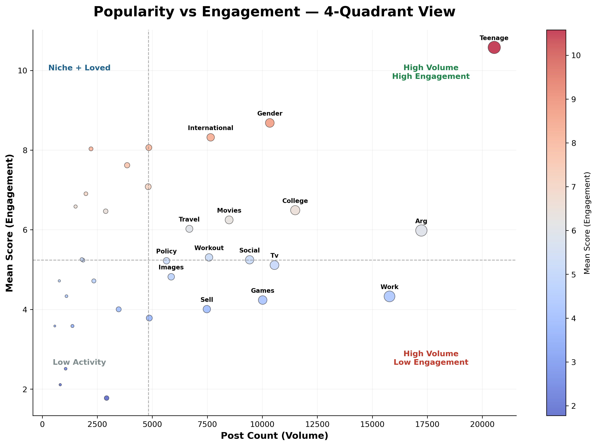
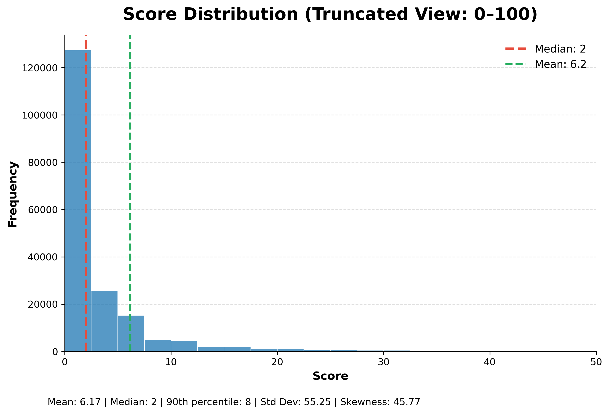
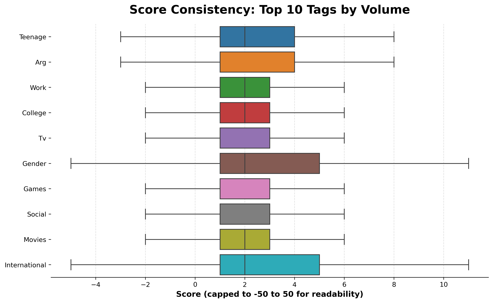
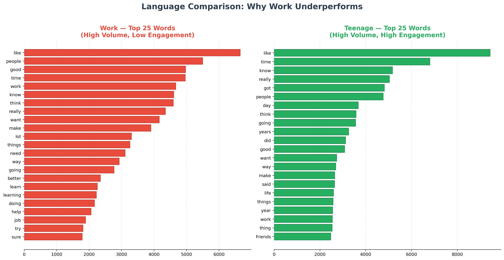
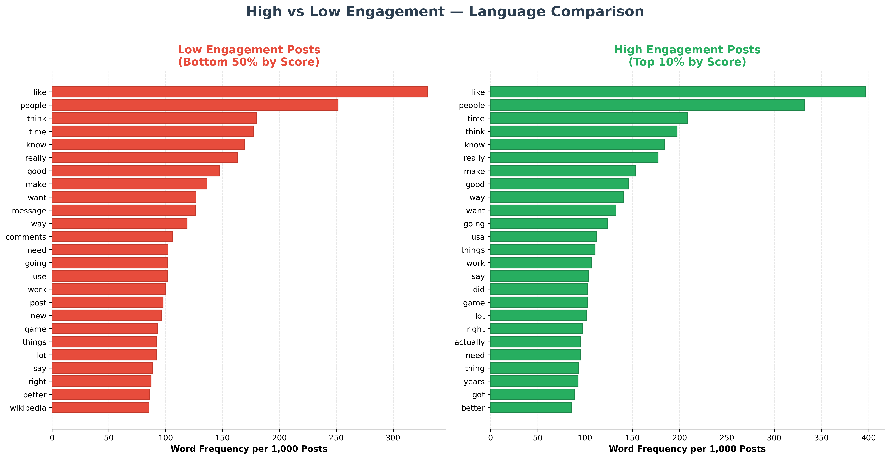

<div align="center">

# Reddit Community Engagement Analysis

**Python | Pandas | Matplotlib | Seaborn | Scikit-learn**

Analyzed 4.5 million Reddit posts across 35 topic tags to find which topics consistently drive engagement, which high-volume topics are wasting posting effort, and what separates high-scoring posts from low-scoring ones.


[](https://colab.research.google.com/github/analytics-ak/reddit-engagement-analysis/blob/main/reddit_engagement_analysis.ipynb)
[](https://mybinder.org/v2/gh/analytics-ak/reddit-engagement-analysis/main?labpath=reddit_engagement_analysis.ipynb)

</div>

---

## The Short Version

4.5 million Reddit posts. Median score of 2. 90% of all posts score 8 or below.

Most content gets almost no reaction — but the distribution is not random. Specific topics consistently outperform others, and the gap is not explained by how much people post. Some of the most posted topics are among the weakest performers.

This analysis builds a framework to separate topics worth investing in from topics where posting effort is being wasted — and shows that engagement depends more on how something is written than what topic it falls under.

---

## The Core Problem

Community platforms optimise for volume — more posts, more topics, more activity. But volume without engagement is just noise.

Tags like Work and Games are among the most posted topics in this dataset. They are also among the lowest scoring. Meanwhile, Photography and Nature have a fraction of the posts but consistently stronger reactions.

For any platform trying to improve time-on-site, feed quality, or creator retention — knowing which topics actually drive engagement versus which ones just drive posting volume is the difference between a growing community and a stagnant one. Improving engagement even slightly in high-volume, low-performing tags can significantly increase total platform activity without adding any new content volume.

---

## The Main Chart — 4-Quadrant Topic Framework

Every tag with 500+ posts plotted by volume vs engagement. This single chart tells the whole story.



| Quadrant | Tags | What It Means |
|---|---|---|
| High Volume + High Engagement | Teenage, Gender, College | Best performers — post a lot, react a lot. Prioritise these. |
| High Volume + Low Engagement | Work, Games, TV, Social | Most wasted effort — tons of posts, weak reactions. Needs rethinking. |
| Niche + High Engagement | Photography, Nature, Treatment | Small but loyal audiences. Growth opportunity. |
| Low Volume + Low Engagement | Hardware, Conversation, Laptops | Lowest priority — not much happening here. |

---

## What the Data Shows

### Most posts get almost no attention

The score distribution is extremely skewed. Median score is 2, mean is 6.2 — pulled up by a small number of viral posts. Using the mean to compare tags is misleading. This analysis uses median and IQR throughout.



---

### Tag rankings change when you use the right metric

Ranking by mean score puts Teenage at the top. But the median for almost every tag is 2. The real difference between tags shows up in IQR — some tags produce more high-scoring posts than others, even though the typical post scores the same across all tags.

Tags with fewer than 500 posts were filtered out to keep rankings reliable.

| Tag | Posts | Mean Score | Median | IQR |
|---|---|---|---|---|
| Teenage | 20,541 | 10.58 | 2.0 | 3.0 |
| Gender | 10,341 | 8.68 | 2.0 | 4.0 |
| International | 7,653 | 8.32 | 2.0 | 4.0 |
| Nature | 4,842 | 8.06 | 2.0 | 3.0 |
| Photography | 2,215 | 8.03 | 2.0 | 2.5 |

---

### Some tags are consistent, others are unpredictable

Gender and International have wide score spreads — some posts do very well, most do not. Work and TV are tight and consistently low — they do not produce breakout posts.

A wide spread means the topic has potential but execution matters. A narrow low spread means the topic just does not generate engagement regardless of how it is written.



---

### Deep dive — why Work underperforms

Work is one of the most posted tags and one of the lowest scoring. Comparing the most common words in Work posts vs Teenage posts shows a clear difference in language style.

Work posts use practical and neutral language. Teenage posts use personal, experience-driven language. Posts that feel like shared experiences outperform posts that feel like information delivery.



---

### High and low scoring posts use the same words

This is the most counterintuitive finding. When all posts are split into top 10% by score vs bottom 50%, the most common words are almost identical. "Like," "people," "think," "time," "know" — they appear in both groups equally.

Engagement is not about keyword choice. It is about framing, tone, and personal expression. You cannot write your way to high scores by swapping in better words.



---

## What Should Be Done

| Problem | Action | Expected Impact |
|---|---|---|
| High-volume, low-engagement topics wasting feed space | Reduce algorithmic amplification of Work, Games, TV posts — or prompt creators to use more personal framing | Improves feed quality and time-on-site without reducing post volume |
| Niche topics with strong engagement are underexposed | Promote Photography, Nature, Treatment to wider audiences via featured sections or recommendations | Brings in users who actually interact — higher engagement per impression |
| Creator effort going into low-return topics | Show creators engagement data by topic before they post | Helps creators make informed decisions about where to invest their time |
| Platform optimising for post volume over engagement quality | Shift content quality metrics to include engagement rate per post, not just total posts | Aligns platform incentives with actual community health |

---

## Sampling Approach

The full dataset has 4.3 million clean rows. Running every analysis on that is unnecessary and slow. A random 200K sample was taken and validated.

Mean and median scores for the top 5 tags match almost exactly between the sample and the full dataset. Tag proportions mirror the full data. The sample holds — all findings are based on it.

---

## What Did Not Separate High From Low

| Factor | Result |
|---|---|
| Specific keywords | Same common words appear in both high and low scoring posts — keyword choice does not drive engagement |
| Topic ID alone | Numeric topic codes carry no insight without the readable tag labels |

Testing what does not work is just as important as finding what does.

---

## Limitations

- Score measures popularity and agreement, not sentiment. A highly upvoted post could be angry, funny, or controversial.
- Tags were pre-assigned — not discovered from the text. This limits how far text-based conclusions can go.
- Score does not capture full engagement. Comments, shares, and awards are not in this dataset.
- No timestamps — trend analysis and seasonal patterns are not possible with this data.
- 200K sample from 4.3M rows. Validated to hold, but edge cases in very small tags may not be fully represented.

---

## Dataset

- **Source:** [Kaggle — Reddit Labeled Post Data](https://www.kaggle.com/datasets/vaibhavsxn/reddit-comments-labeled-data)
- **Rows:** ~4.6 million (200K sample used for analysis)
- **Columns:** 4 — score, body, Topic, Tag
- **Tags:** 35 categories

---

## Tools Used

| Tool | Used For |
|---|---|
| Python | Data cleaning, feature engineering, analysis |
| Pandas | Grouping, filtering, aggregation |
| NumPy | Numerical operations |
| Matplotlib | All charts and visualizations |
| Seaborn | Statistical plots and styled visuals |
| Scikit-learn | CountVectorizer for word frequency analysis |
| Jupyter Notebook | Full end-to-end analysis |

---

## Project Structure

```
reddit-engagement-analysis/
│
├── reddit_engagement_analysis.ipynb  ← Full analysis notebook
├── README.md                          ← You are reading this
│
└── images/
    ├── score_distribution.png
    ├── tag_stability_boxplot.png
    ├── popularity_vs_engagement_quadrant.png
    ├── work_vs_teenage_words.png
    └── high_vs_low_engagement_words.png
```

---

## How to Run This

1. Clone this repo
   ```bash
   git clone https://github.com/analytics-ak/reddit-engagement-analysis.git
   ```
2. Install required libraries
   ```bash
   pip install pandas numpy matplotlib seaborn scikit-learn
   ```
3. Open the notebook
   ```bash
   jupyter notebook reddit_engagement_analysis.ipynb
   ```
4. Run all cells — charts generate automatically

---

## Conclusion

90% of Reddit posts score 8 or below. The platform is flooded with content that nobody reacts to — and the pattern is not random.

High-volume topics like Work and Games consistently underperform. Niche topics like Photography and Nature consistently overperform relative to their size. And the words used in high-scoring posts are almost identical to those in low-scoring posts — which means engagement is not a keyword problem. It is a framing and tone problem.

For any platform trying to improve community health, the answer is not more posts. It is better understanding of which topics and which writing styles actually generate reactions — and building that understanding into how content is surfaced, promoted, and recommended.

---

## Author

**Ashish Kumar Dongre**

🔗 [LinkedIn](https://www.linkedin.com/in/analytics-ashish/) &nbsp;|&nbsp; 💻 [GitHub](https://github.com/analytics-ak/reddit-engagement-analysis/) &nbsp;|&nbsp; 📂 [Dataset on Kaggle](https://www.kaggle.com/datasets/vaibhavsxn/reddit-comments-labeled-data)
